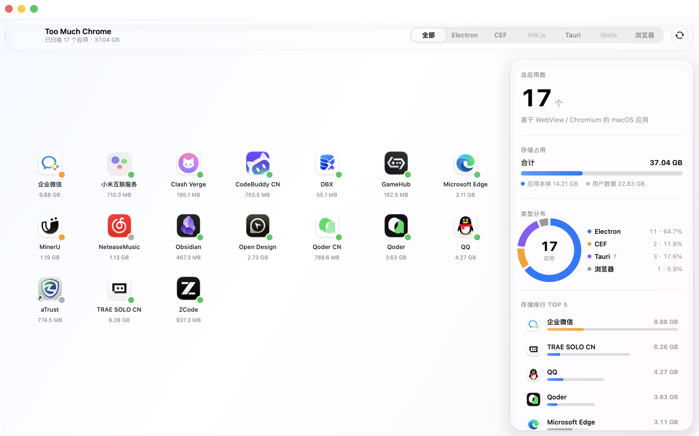

# Too Much Chrome

> [English](README.en.md) · [日本語](README.ja.md) · [官网](https://acerola-1.github.io/too-much-chrome/)

<p align="center">
  
</p>

<p align="center">
  <strong>看看你的 Mac 里藏了多少网页引擎应用。</strong>
</p>

<p align="center">
  Too Much Chrome 扫描 macOS 上所有基于 Chromium / WebView 的应用——Electron、CEF、NW.js、
  Tauri、Wails，以及 Chrome、Edge、Brave 这类完整浏览器——并统计它们占用的存储空间与版本健康度。
  名字是个梗，扫描是认真的。
</p>

<p align="center">
  <a href="https://github.com/Acerola-1/too-much-chrome/releases/latest"><strong>下载最新版</strong></a> ·
  <a href="https://acerola-1.github.io/too-much-chrome/"><strong>官网</strong></a> ·
  <a href="#功能亮点">功能亮点</a> ·
  <a href="#安装">安装</a> ·
  <a href="#系统要求">系统要求</a> ·
  <a href="#构建">构建</a>
</p>

<p align="center">
  
  
  
  
  
</p>

## 截图

### 扫描结果主界面

浮动玻璃工具栏与右侧报告面板同处一条主线：左侧网格按发现顺序逐个显现应用，扫描线光条即真实扫描进度；右侧一屏汇总总数、存储占用、类型分布环形图、Top 5 排行与版本健康度。

<p align="center">
  
</p>

## 功能亮点

### 真实扫描

枚举 `/Applications` 与 `~/Applications` 顶层 `.app`。Electron / CEF / NW.js 按
`Contents/Frameworks` 框架目录名与 plist Bundle ID 双特征识别，接近 100% 准确率——
改名构建（如 QQNT.framework）仍保留 `com.github.Electron.framework`，是目录名之外的第二特征；
Tauri / Wails 走 Bundle ID / 资源目录关键词与主二进制构建路径特征，实验性标注如实呈现。

### 体积统计

应用本体递归计算分配大小，加上 `~/Library` 用户数据（Application Support / Caches /
Containers / WebKit / Saved Application State / Logs），按 bundle id 与应用名双重匹配并去重。

### 版本健康度

按在线版本基准动态分档五档状态（绿 → 红）：Electron 走 npm registry、Chromium 走 Google
VersionHistory、Tauri 走 crates.io、Wails 走 Go module proxy；缓存 24 小时，单项失败沿用缓存值，
全部失败退内置锚点，离线照常可用。

### 扫描线开场

复印机扫描线绑定真实扫描进度——光条位置即扫描进度，图标按发现顺序逐个去模糊显现。
「减少动态效果」开启时自动跳过动画。

### 报告面板与详情弹层

点击任意应用查看存储分解与安装路径，一键在 Finder 中显示；排行行与网格图标联动高亮，`⌘R` 随时重扫。

### Swift 原生，一次任务

Swift / SwiftUI 原生开发，macOS 26+ 自动启用液态玻璃（低版本回退毛玻璃材质）。
扫描在后台线程进行，主线程只做结果呈现，扫完即走，无常驻进程。

## 安装

1. 从 [Releases](https://github.com/Acerola-1/too-much-chrome/releases/latest) 下载最新版 `.dmg`
2. 打开 DMG，将 Too Much Chrome 拖入 Applications 文件夹
3. 从 Launchpad 或 Applications 启动，首次扫描自动开始

应用已通过 Apple 公证，下载后可直接打开。

## 系统要求

- macOS 14 及以上（macOS 26+ 自动启用液态玻璃）
- Apple Silicon（M 系列芯片，仅支持 arm64，不提供 Intel 版）

## 构建

SwiftPM 工程，Xcode 可直接打开 `Package.swift` 开发：

```bash
./launch.sh            # 一键构建 .app 并启动（内部走 scripts/build-app.sh dev）
./launch.sh cli        # 构建并运行无头扫描 CLI（tmc-scan）
swift build            # 编译全部 target
swift test             # 单元测试
swift run tmc-scan --online   # 无头扫描（在线版本基准分档）
```

对外分发（Developer ID 签名 + Apple 公证 + DMG）走 `scripts/build-app.sh`：

```bash
./scripts/build-app.sh release    # 组装 .app + Developer ID 签名（硬运行时 + 时间戳）
./scripts/build-app.sh notarize   # 提交 Apple 公证并 staple 票据
./scripts/build-app.sh dmg        # 生成并公证 DMG（对外分发物）
```

发布版本由 `scripts/release.sh` 驱动：更新版本号 → 生成发布说明 → 合入 main → 打 tag →
GitHub Actions 自动构建、签名、公证并发布 Release（详见 `.github/workflows/release.yml`）。

## Star History

<p align="center">
  <a href="https://star-history.com/#Acerola-1/too-much-chrome&Date">
    <picture>
      <source media="(prefers-color-scheme: dark)" srcset="https://api.star-history.com/svg?repos=Acerola-1/too-much-chrome&type=Date&theme=dark" />
      <source media="(prefers-color-scheme: light)" srcset="https://api.star-history.com/svg?repos=Acerola-1/too-much-chrome&type=Date" />
      
    </picture>
  </a>
</p>

<p align="center">
  如果这个项目对你有帮助，欢迎点一个 ⭐ 支持持续维护。
</p>

## 许可证

本项目采用 **GNU AGPL-3.0** 双许可模式：

- **开源使用**：源码公开，任何人可在 [AGPL-3.0](LICENSE) 条款下自由查看、修改、分发。
  按 AGPL 要求，任何基于本项目的衍生作品（含通过网络提供服务的情形）也必须以
  AGPL-3.0 开源其完整源码。
- **商业使用**：如果你希望在**不遵守 AGPL 开源义务**的前提下将本项目用于商业产品
  （例如闭源分发、上架收费而不公开源码），**必须获取商业授权**。
  请通过 [GitHub](https://github.com/Acerola-1/too-much-chrome) 提 Issue 或私信作者洽谈。

版权所有 © 2026 Acerola。保留所有权利。

### 第三方组件

本项目唯一的第三方依赖是 **Sparkle**（自更新框架）—— MIT 类许可；
其余全部使用系统框架（SwiftUI / AppKit / Foundation）。
